# SMS Spam Killer Architecture

This document provides a detailed technical overview of the SMS Spam Killer architecture, including the TagRouter Engine and the SMS domain implementation.

## Table of Contents

- [System Overview](#system-overview)
- [Core Concepts](#core-concepts)
- [TagRouter Engine](#tagrouter-engine)
- [Processing Pipeline](#processing-pipeline)
- [Plugin System](#plugin-system)
- [Domain Implementation](#domain-implementation)
- [Event System](#event-system)
- [Extension Points](#extension-points)

---

## System Overview

SMS Spam Killer is built on a two-layer architecture:

1. **TagRouter Engine** (`@tagrouter/engine`): A domain-agnostic classification and orchestration framework
2. **SMS Domain Implementation**: The concrete implementation for SMS/iMessage filtering

### High-Level Architecture

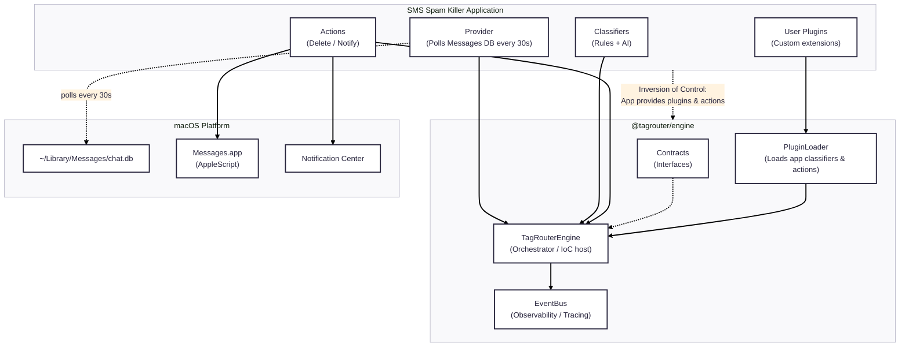

---

## Core Concepts

### Inversion of Control (IoC)

The TagRouter Engine implements IoC - the framework calls your code, not the other way around:

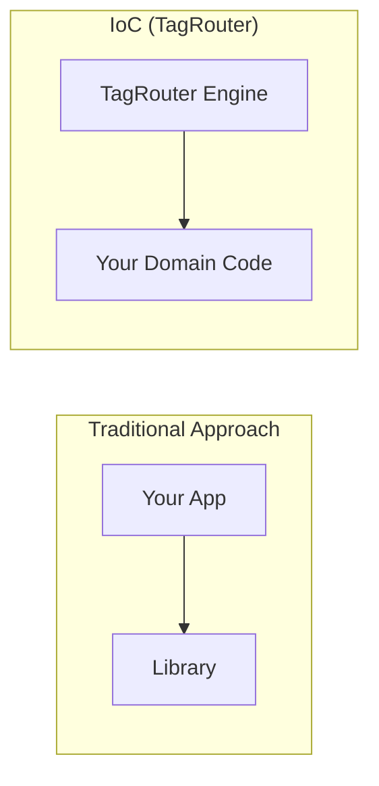

**Benefits:**
- Engine is reusable across domains (SMS, email, social media)
- Domain code focuses purely on business logic
- Consistent execution lifecycle across all domains

### Contract-Based Design

All components implement well-defined contracts (interfaces):

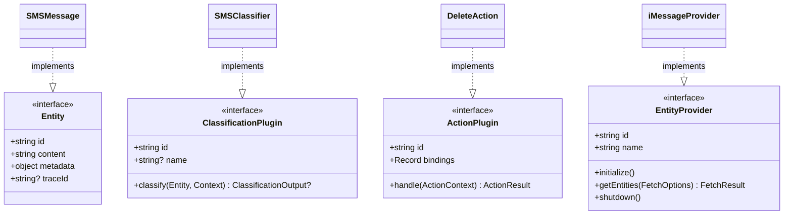

---

## TagRouter Engine

### Engine Responsibilities

The TagRouter Engine handles:

1. **Lifecycle Management**: Start, stop, graceful shutdown
2. **Entity Polling**: Pull entities from providers at configurable intervals
3. **Classification Pipeline**: Run all classifiers, resolve conflicts by confidence
4. **Action Dispatch**: Execute actions based on classification results
5. **Event Emission**: Notify subscribers at each processing stage

### Engine Internals

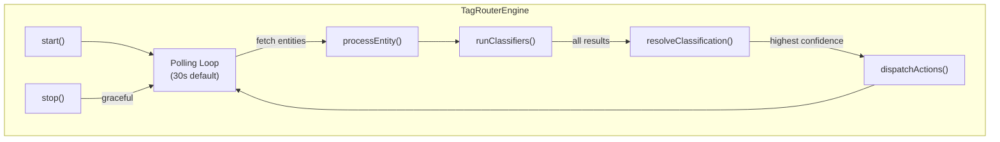

### Domain Registration

Domains register themselves with the engine:

```typescript
const engine = new TagRouterEngine({
    pollingInterval : 30000,
    batchSize       : 10,
});

engine.registerDomain({
    id          : "sms",
    name        : "SMS Spam Killer",
    provider    : iMessageProvider,
    classifiers : [systemRules, aiClassifier, ...userPlugins],
    actions     : [deleteAction, notifyAction],
    config      : { dryRun: true },
});

await engine.start();
```

---

## Processing Pipeline

### Complete Message Flow

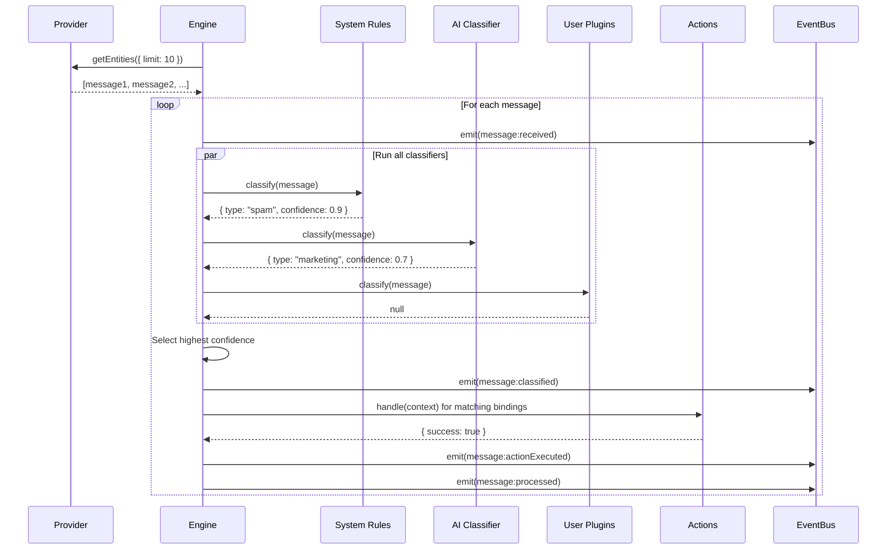

### Confidence Resolution

When multiple classifiers return results, the highest confidence wins:

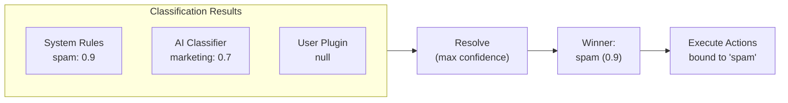

**Confidence Guidelines:**
| Confidence | Meaning | Example |
|------------|---------|---------|
| 1.0 | Hard rule match | Exact regex match |
| 0.9-0.99 | High confidence rule | Pattern + context |
| 0.5-0.89 | Probabilistic | AI classification |
| <0.5 | Weak heuristic | Partial matches |

---

## Plugin System

### Plugin Loading Order

Plugins are loaded and executed in a specific order:

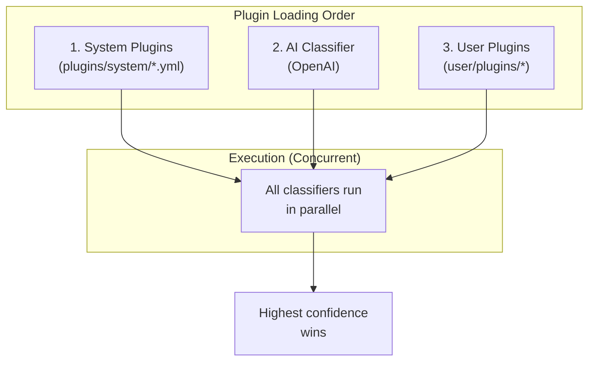

### YAML Plugin Format

Simple rules can be defined in YAML:

```yaml
- name: crypto-spam
  description: Cryptocurrency investment scams
  match:
    regex: "\\b(bitcoin|crypto).*(invest|profit)"
    sender: "^\\d{5,6}$"  # Optional: sender pattern
    contains: "guaranteed"  # Optional: substring match
  type: spam
  confidence: 0.95
  tags:
    - crypto
    - investment
```

### TypeScript Plugin Format

Complex logic requires TypeScript:

```typescript
export const myClassifier: ClassificationPlugin = {
    id          : "my-classifier",
    name        : "My Classifier",
    description : "Custom classification logic",

    classify(message: Entity, context: ClassificationContext) {
        const { logger, config } = context;

        // Access message content and metadata
        const content = message.content;
        const sender  = message.metadata?.sender;

        // Your classification logic
        if (someCondition) {
            return {
                type       : "spam",
                confidence : 0.85,
                tags       : ["custom-rule"],
            };
        }

        // Return null to defer to other classifiers
        return null;
    },
};
```

### Action Plugin Format

Actions declare which message types they handle:

```typescript
export const deleteAction: ActionPlugin = {
    id: "delete-spam",

    // Declarative bindings: type -> confidence threshold
    bindings: {
        spam : { minConfidence: 0.9 },
        scam : { minConfidence: 0.9 },
    },

    async handle(context: ActionContext): Promise<ActionResult> {
        const { message, classification, logger } = context;

        // Perform the action
        await deleteConversation(message.metadata.sender);

        return {
            actionId : this.id,
            success  : true,
        };
    },
};
```

---

## Domain Implementation

### SMS Entity

The SMS domain extends the base Entity:

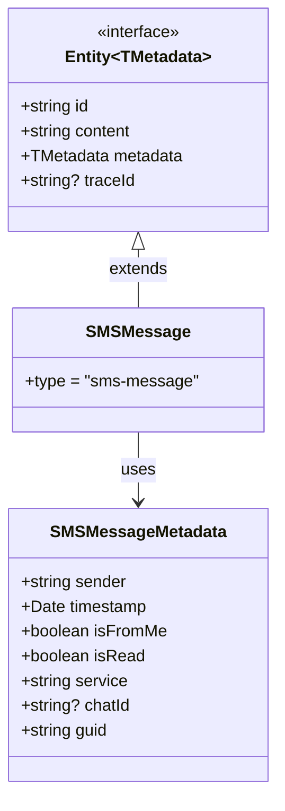

### iMessage Provider

The provider reads from the macOS Messages database:

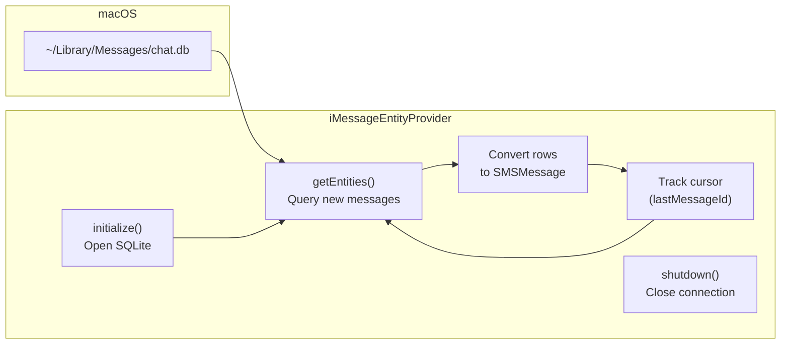

### Actions

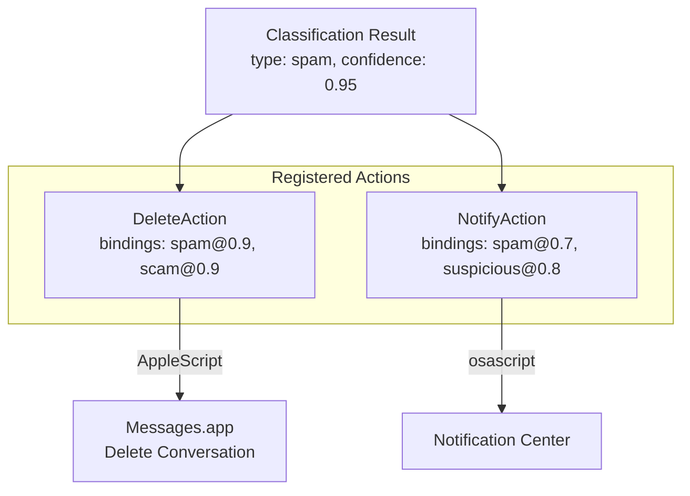

---

## Event System

### Event Types

The engine emits events at each lifecycle stage:

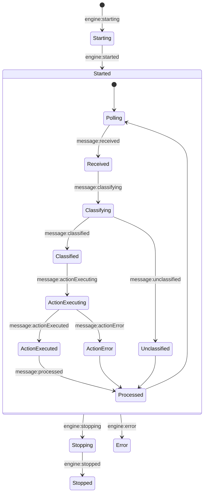

### Event Subscription

```typescript
// Subscribe to all events
engine.eventBus.subscribe("*", (event) => {
    console.log(`[${event.type}]`, event.data);
});

// Subscribe to specific events
engine.eventBus.subscribe("message:classified", (event) => {
    const { messageId, classification } = event.data;
    console.log(`Classified ${messageId} as ${classification.type}`);
});

// One-time subscription
engine.eventBus.once("engine:started", () => {
    console.log("Engine is ready!");
});
```

### Event Payload

```typescript
interface EventPayload {
    readonly type      : string;       // Event type
    readonly timestamp : string;       // ISO timestamp
    readonly traceId?  : string;       // For correlation
    readonly data?     : Record<string, unknown>;
}
```

---

## Extension Points

### Adding a New Classifier

1. Create a TypeScript file in `user/plugins/`:

```typescript
// user/plugins/my-classifier.ts
import type { ClassificationPlugin } from "@tagrouter/engine";

export const myClassifier: ClassificationPlugin = {
    id: "my-classifier",
    classify(message, context) {
        // Your logic
        return { type: "custom-type", confidence: 0.9 };
    },
};

export default myClassifier;
```

2. Rebuild and restart:

```bash
npm run build
npm start
```

### Adding a New Action

1. Create an action plugin:

```typescript
// user/plugins/my-action.ts
import type { ActionPlugin } from "@tagrouter/engine";

export const myAction: ActionPlugin = {
    id: "my-action",
    bindings: {
        "custom-type": { minConfidence: 0.8 },
    },
    async handle(context) {
        // Your action logic
        return { actionId: this.id, success: true };
    },
};
```

### Adding a New Domain

The engine is domain-agnostic. To add a new domain (e.g., email):

```typescript
// 1. Define your entity
interface EmailMessage extends Entity<EmailMetadata> {
    type: "email-message";
}

// 2. Create a provider
const emailProvider: EntityProvider<EmailMessage> = {
    id: "gmail-provider",
    name: "Gmail Provider",
    async getEntities(options) {
        // Fetch emails from Gmail API
        return { entities, cursor, hasMore: false };
    },
};

// 3. Create classifiers and actions
// ...

// 4. Register with the engine
engine.registerDomain({
    id          : "email",
    name        : "Email Spam Killer",
    provider    : emailProvider,
    classifiers : [emailClassifier],
    actions     : [emailActions],
});
```

---

## Summary

The SMS Spam Killer architecture emphasizes:

| Principle | Implementation |
|-----------|----------------|
| **IoC** | Engine orchestrates; domains supply logic |
| **Contracts** | Clean interfaces for all components |
| **Plugins** | YAML for rules, TypeScript for logic |
| **Concurrency** | All classifiers run in parallel |
| **Determinism** | Highest confidence wins, consistent order |
| **Observability** | Events at every stage, trace IDs |
| **Extensibility** | User plugins, new domains, custom actions |

For the design philosophy behind these decisions, see:
- [docs/tagrouter-complete-updated-design.md](docs/tagrouter-complete-updated-design.md)
- [docs/tagrouter-high-level-design.md](docs/tagrouter-high-level-design.md)
