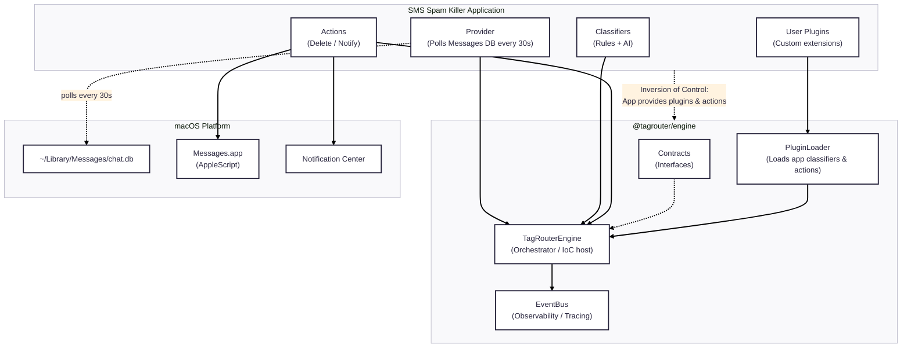

# SMS Spam Killer

An intelligent SMS/iMessage spam detection and filtering system built on the **TagRouter Engine**, a domain-agnostic classification framework designed with Inversion of Control (IoC) and plugin-based extensibility.

## Overview

SMS Spam Killer monitors your macOS Messages.app database, classifies incoming messages using a combination of pattern-based rules and AI-powered classification, and automatically handles spam through configurable actions (delete, notify, etc.).

### Key Features

- **AI-Powered Classification**: Uses OpenAI to classify messages with nuanced understanding
- **Rule-Based Fallback**: High-confidence pattern matching runs before AI for speed and cost efficiency
- **Plugin Architecture**: Extend with custom classifiers and actions via TypeScript or YAML
- **Domain-Agnostic Engine**: The underlying TagRouter Engine can be reused for email, social media, or any classification domain
- **Pull-Based Architecture**: No message queue required - runs as a daemon that polls the Messages database
- **Full Observability**: Event-driven architecture with trace IDs for debugging and monitoring

### System Requirements

- macOS (for Messages.app integration)
- Node.js 18+
- OpenAI API key (for AI classification)
- Full Disk Access permission (to read `~/Library/Messages/chat.db`)

## Table of Contents

- [Architecture](#architecture)
- [Quick Start](#quick-start)
- [How It Works](#how-it-works)
- [Plugin System](#plugin-system)
- [Configuration](#configuration)
- [Development](#development)
- [Documentation](#documentation)

## Architecture

SMS Spam Killer follows a layered architecture with clear separation of concerns:



For detailed architecture diagrams and component descriptions, see [ARCHITECTURE.md](ARCHITECTURE.md).

## Quick Start

### 1. Clone and Install

```bash
git clone https://github.com/iconify/sms-spam-killer.git
cd sms-spam-killer/v2

# Install dependencies
npm install

# Build the engine and app
npm run build -w packages/engine
npm run build -w apps/sms-spam-killer
```

### 2. Configure

```bash
# Set your OpenAI API key
export OPENAI_API_KEY="sk-..."

# Grant Full Disk Access to your terminal in System Settings
# (Required to read ~/Library/Messages/chat.db)
```

### 3. Run

```bash
# Dry-run mode (no deletions, just classification)
cd apps/sms-spam-killer
npm start

# Live mode (actually deletes spam)
npm start -- --live
```

## How It Works

### Processing Pipeline

For each incoming message:

1. **Fetch**: Engine polls the Messages.app database for new messages
2. **Classify**: All classifiers run concurrently
3. **Resolve**: Highest confidence result wins
4. **Dispatch**: Actions bound to the message type execute
5. **Complete**: Events emitted for observability

```
Message --> System Rules --+--> AI Classifier --+--> Resolve --> Actions
            (fast, cheap)  |   (nuanced)        |    (highest
                           |                    |    confidence)
           User Plugins ---+                    |
            (custom)                            |
                                                v
                                        spam (0.95) --> Delete + Notify
                                        scam (1.00) --> Delete + Notify
                                        personal    --> (no action)
```

### Classification Types

The system classifies messages into categories defined in `apps/sms-spam-killer/config/types.yml`:

| Type | Description | Default Action |
|------|-------------|----------------|
| `spam` | Marketing, promotional | Delete (>0.9 confidence) |
| `scam` | Phishing, fraud attempts | Delete (>0.9 confidence) |
| `political_spam` | Political fundraising | Notify (>0.7 confidence) |
| `transactional` | Verification codes, alerts | None (safe) |
| `personal` | Friends, family | None (safe) |

## Plugin System

SMS Spam Killer supports three plugin types, loaded in this order:

### 1. System Plugins (YAML)

High-confidence pattern rules that run before AI:

```yaml
# plugins/system/spam-patterns.yml
- name: crypto-spam
  description: Cryptocurrency investment scams
  match:
    regex: "\\b(bitcoin|crypto).*(invest|profit|earn)"
  type: spam
  confidence: 0.95
  tags: [crypto, investment]
```

### 2. AI Classifier

Probabilistic classification using OpenAI GPT models. Handles nuanced cases that pattern matching can't catch.

### 3. User Plugins (TypeScript/YAML)

Custom plugins in `apps/sms-spam-killer/user/plugins/`:

```typescript
// user/plugins/my-classifier.ts
import type { ClassificationPlugin } from "@tagrouter/engine";

export const myClassifier: ClassificationPlugin = {
    id          : "my-custom-classifier",
    name        : "My Classifier",
    description : "Custom classification logic",

    classify(message, context) {
        // Your logic here
        if (message.content.includes("my-keyword")) {
            return { type: "known", confidence: 1.0 };
        }
        return null; // Let other classifiers handle it
    },
};
```

See [apps/sms-spam-killer/user/plugins/example-classifier.ts](apps/sms-spam-killer/user/plugins/example-classifier.ts) for a complete example.

## Configuration

### User Settings

Customize behavior in `apps/sms-spam-killer/user/settings.yml`:

```yaml
# Polling interval (ms)
pollingInterval: 30000

# Dry-run mode (no actual deletions)
dryRun: true

# Action confidence thresholds
actions:
  delete:
    spam: 0.9
    scam: 0.9
  notify:
    spam: 0.7
    suspicious: 0.8
```

### Environment Variables

| Variable | Description |
|----------|-------------|
| `OPENAI_API_KEY` | Required for AI classification |

## Development

### Project Structure

```
v2/
├── packages/
│   └── engine/              # @tagrouter/engine - the core framework
│       ├── src/
│       │   ├── contracts/   # Interface definitions
│       │   ├── engine/      # TagRouterEngine implementation
│       │   ├── impl/        # Built-in implementations
│       │   └── plugins/     # Plugin loader
│
└── apps/
    └── sms-spam-killer/     # SMS domain implementation
        ├── src/
        │   ├── domain/      # SMS-specific entities, providers, actions
        │   ├── adapters/    # macOS integrations (SQLite, AppleScript)
        │   └── config/      # Configuration loaders
        ├── plugins/
        │   └── system/      # Built-in spam patterns
        └── user/            # User customization (protected)
```

### Running Tests

```bash
# Run all tests
npm test

# Run tests in watch mode
npm run test:watch
```

### Building

```bash
# Build engine
npm run build -w packages/engine

# Build app
npm run build -w apps/sms-spam-killer
```

## Documentation

| Document | Description |
|----------|-------------|
| [ARCHITECTURE.md](ARCHITECTURE.md) | Detailed architecture with Mermaid diagrams |
| [docs/tagrouter-complete-updated-design.md](docs/tagrouter-complete-updated-design.md) | Core design philosophy |
| [docs/tagrouter-high-level-design.md](docs/tagrouter-high-level-design.md) | Framework design principles |
| [docs/adr/ADR-001-yaml-type-definitions.md](docs/adr/ADR-001-yaml-type-definitions.md) | Architecture Decision Record: YAML types |

## Design Principles

### Inversion of Control (IoC)

The TagRouter Engine doesn't know about SMS or iMessage - it provides the orchestration infrastructure while domain implementations (like this SMS app) supply the concrete logic. This enables reuse across different domains (email, social media, etc.).

### Determinism

- All classifiers run (not chain-of-responsibility)
- Highest confidence wins deterministically
- Actions execute in registration order
- Idempotent actions enable safe retries

### Immutability

- Entities are immutable within the pipeline
- Classification outputs are frozen
- No mutation of input data
- Safe for concurrent execution

### Observability

- Events at every lifecycle stage
- Trace IDs for correlation
- Structured logging with context

## License

MIT

## Contributing

Contributions are welcome. Please read the architecture documentation before submitting PRs.
